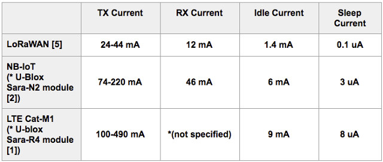
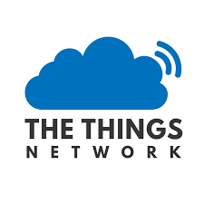
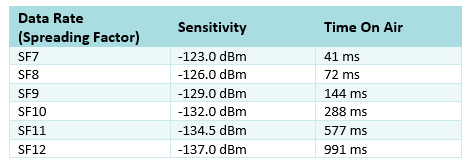

# Evaluation
This document provides informations about the "evaluation" branch of the project

## Constraints
The devices work in very particular and limit conditions, like thick walls, absence of electrical sources and difficulties in comunicating cause in the underground, but they don't need a large bandwidth and no *real time* data are required

## Performance evaluation

Performance evaluation mainly concerns two aspects: evaluation for the physical characteristics of the devices and evaluation of the performance of the cloud infrastructure.

In general, some of the criteria we focused on are: 
* Device management (sensors, firmware, OTA updates...)
* Data management and Analysis (control and monitoring condition)
* Connectivity and Protocols (Packet loss and data rate, gateways...)
* Scalability (bandwidth limits and data storage)
* Costs (devices and connection costs)
* User management (roles, data access)

### Device management
For each device, it is essential to have certain monitored characteristics:
* **Power consumption:** Must be reduced as possible due to the boundary conditions in which devices work, where is impossible to have an external elettrical support. It is advisable to monitor the state of the battery in order to have possibility of physical maintance to prevent issues. This can be done appropriately calculating sensing and sending times: fewer detections possible, fewer deliveries possible, lower will be the consumption
* **Measurement speed:** Take into account the measurement times of the various sensors and board's clock speed to calculate the correct "sensing" time, especially if some measurements are "event driven". 
* **Capacity:** Measurements must be as accurate as possible, but the possibility of having noise exist and it's advisable to consider "limit" parameters, in order to provide the cleanest data possible.

Supply some sort of OTA firmware updates could be interesting for device software maintance.

**Extra Feature:** An extra feature could be an algorithm that provides a *max time* and a *min time* for sensing the environment, times calculated based on the quality of the various measurements.

### Connectivity
The connectivity aspect is fundamental in the IoT's world. Every sensing could be communicated to the cloud infrastructure, considering the limits of "LoRa" infrastructure for data passing, and are also required parameters for monitoring loss of data packets.

LoRa, according to specifications and TTN docs, has limits on payload size, bandwidth and transmission time.

For lowest power devices, **A class devices**, a Downlink (to devices) is only possible after Uplink (to network) and the maximum application packet size for the European 863-870MHz band is:
* 51 bytes for the slowest data rates like SF10, SF11 and SF12 (125 kHz)
* 115 bytes for SF9 (125kHz)
* 22 bytes for faster rates like SF7 (250kHz) and SF8 (125kHz)

And LoRa attach a 13bytes header to the application packet.

>For example, a 51bytes packet + 13bytes header on SF12 may take:
>* 2,79s of airtime
>* 279.3s of "1% duty cycle"
>
>This means that could be uploaded only 12msg/hour, but, considering "fair access >policy", it drastically fall to 10msg/day.

The adaptive data rate in LoRa allows us to send more message per day simply having a near gateway in order to reduce the airtime. So, we have to consider some gateways close to devices zone to be able to exploit the SF7. 

More infos [here](https://avbentem.github.io/airtime-calculator/ttn/eu868/51)

### Data management, Analysis and Scalability
All data must be able to be monitored constantly but we don't need any type of *real time* solutions. Noise detection algorithms need to be considered also at the cloud analysis level, in order to have the best possible measurements.

Communication, through the *TTN Network*, allows us to have a good amount of data, but, to avoid useless write accesses to database, we have to process these data in advance.

### User management
Also the user, for his part, requires evaluation parameters. Each user who accesses the system must have a specific role within it, based on the appropriate use. Roles not properly calculated can lead to unwanted accesses and, consequently, to security holes.

Recurrent feedbacks with users are fundamental in order to avoid malfunctions and for increase the UX

### Costs
Accurately monitoring costs and a great budgeting are essential for the success of the project. Of course, each device has manufacturing costs linked to the quality of board, sensors, batteries and extra modules (like LoRa's antenna or all-in-one module), but the cost of managing cloud resources should not be forgotten, as well as any costs for additional network infrastructures (like gateways)

## First production deploy
After first deploy, we are interested in monitoring environmental impact (reduction of water pollution), tracing of polluted channels and actual presence of solid objects that can obstruct the sewer channels