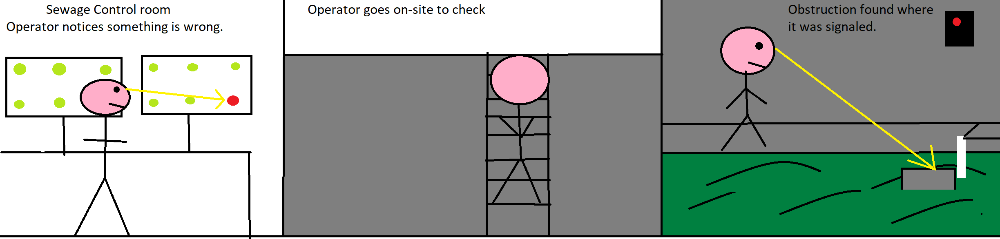
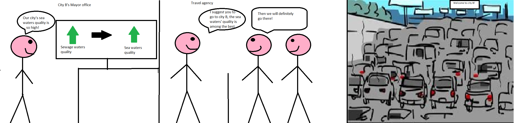

# Concept
This document introduces Kloaka.
## \[20/05/2021] v2: Group Project MVP Presentation
*Considering the [comments](./Second_Delivery/2nd_delivery.md) received during the 1st delivery, the project's scope was downsized accordingly.*

We believe that there is a tight relationship between the quality of marine waters and that of those waters that flow into seas, such as sewage waters.

In order to improve the sea conditions from several points of view (aquaculture and coastal tourism for example), it is necessary to monitor the factors that influence them, namely the quality of sewage waters, which flow almost directly into the seas.

We introduce Kloaka: an automated sytem whose aim is to the detect the presence of leakages or physical obstructions inside sewage pipes. 

Kloaka's aim is to enhance the quality of the maritime waters by providing the means to *control the flow of sewage waters* and thus detect: leakages, potential dumping of illegal substances in the sewers (which, if more dense or if the flow significanly increases, will result in changes to the natural flow of wastewaters) and physical obstructions in the pipes, which will of course bring negative effects to sea waters, were this kind of waters flow.

As a natural consequence, those maritime cities employing the system we propose will be able to gain a lot of benefits coming from the capability to boast about having higher quality sea waters, such as attracting more tourists.

## Personas 

We identified the 3 following personas who would benefit from our solution:

* Bob the Maintenance Worker
    - Age: 35-60
    - Education: High School
    - Marital Status: Married
    - Income range: $32k - $48k
    - Career type: Steadily Employed
    - Description: Bob is an employee of a private company that delivers public services, such as water or electricity management.

* Mark the Public Administrator
    - Age: 40 - 60
    - Education: Bachelors
    - Marital Status: Married
    - Income Range: $71k - $120k 
    - Career type: Limited-time mandate 
    - Description: Mark is a PA employee covering an important position (such as a Mayor) in a big city.

* Sara the maritime Tour Operator
    - Age: 25-50
    - Education: Bachelors
    - Marital Status: Single
    - Income Range: $32k - $55k
    - Career type: Steadily Employed
    - Description: Sara is a tour operator that specializes in maritime tourist destinations. 

## Storyboards
### 1 - The system signals an obstruction in a sewer canal

### 2 - Mayor boasts for the quality of waters in his city. Tour operator advertises location. Tourism increases.

## \[08/04/2021] v1: Initial Ideas Pitch
## The Problem and our Proposed Solution

We believe that there is a tight relationship between the quality of marine waters and that of those waters that flow into seas, such as sewage waters.

In order to improve the sea conditions from several points of view (aquaculture and coastal tourism for example), it is necessary to monitor the factors that influence them, namely the quality of sewage waters, which flow almost directly into the seas.

We introduce Kloaka: an automated system to probe the quality of sewage waters and to detect the potential presence of physical obstructions in the pipes. Our focus is the so-called "storm sewage", that is water that originates from precipitations such as rain, snow and ice melt. Storm sewage is usually poorly checked and oftentimes it does not even undergo any kind of purification treatment, therefore it directly flows into the sea.

Kloaka's aim is to enhance the quality of the maritime waters by providing the means to control the quality of storm sewage flowing into the seas.

As a natural consequence, those maritime cities employing the system we propose will be able to gain a lot of benefits coming from the capability to boast about having higher quality sea waters, such as attracting more tourists.

## Personas 

We identified the 3 following personas who would benefit from our solution:

* Bob the Maintenance Worker
    - Age: 35-60
    - Education: High School
    - Marital Status: Married
    - Income range: $32k - $48k
    - Career type: Steadily Employed
    - Description: Bob is an employee of a private company that delivers public services, such as water or electricity management.

* Mark the Public Administrator
    - Age: 40 - 60
    - Education: Bachelors
    - Marital Status: Married
    - Income Range: $71k - $120k 
    - Career type: Limited-time mandate 
    - Description: Mark is a PA employee covering an important position (such as a Mayor) in a big city.

* Sara the maritime Tour Operator
    - Age: 25-50
    - Education: Bachelors
    - Marital Status: Single
    - Income Range: $32k - $55k
    - Career type: Steadily Employed
    - Description: Sara is a tour operator that specializes in maritime tourist destinations. 

## Storyboards
### 1 - The system signals an obstruction in a sewer canal

### 2 - Mayor boasts for the quality of waters in his city. Tour operator advertises location. Tourism increases.

