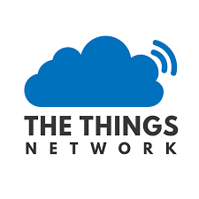

# Evaluation
This document provides information about the "evaluation" branch of the project

## [16/07/2021] v3: Final Delivery
### Input data evaluation


The board runs on a modified version of the system that collects and sends raw sensor data over mqtt where is consumed by a python script that stores the values.
We decided to toggle the interreading time of the ultrasonic sensor.
The value are labeled in four different states: OFF, OFF2ON, ON, ON2OFF.
We made 10 measures for each state and repeated 2 experiments, looking at data we see that results obtained changing the interreading time of the ultrasonic sensor are more or less the same, the only difference we found is that for small times we have more outlier in the measure, we so choose to stick with 300ms. 


We make the median and standard deviation of our sampled data and if a sampled value dows not fall into mean+-std_dev we detect a change of state, we reset the mean and the stddev, and repeat the process.
We calculate the mean as
```
M1=x1 
S1=0
Mk=Mk−1+(xk−Mk−1)/k
as well the standard deviation as
Sk=Sk−1+(xk−M_k−1)∗(xk−Mk)
```
### Output data evaluation
To evaluate the performace of our sensor used our test setup removing the relay and actionating the pumb by hand.
We than have noticed that data from the sensor was different from data collected during experiments thus our developed algorithm was ineffective. In fact data readed from the sensor in se is static while data retrived whitin the data collecting infrastructure varies as shown.

### Speed
A sleeping phase (interval between sensig phases) lasts for 20 minutes, the sensing phase lasts about 1 minute and its repeated and the trasmitting operation requires about 10 seconds each hour thus we have that data is sended by each device with a duty cycle of 62,73 minutes.

### Energy
We will assume that LoRa transmission use about 10mA (as we were unable to get real world data), in sleeping phase we measured 1mA and when we wake up our consuption is 7.5mA.
We measured the consuptions via a voltage meter hoked up to a 1 ohm resistor though the IDD pins on the board.
We get the consumption of our device multiplyng the consumption for the different states and the period of eache state and divide by the sum of periods.
```
 (20*3*1+0.76*3*7.5+0.16*30)
---------------------------- =1.3mA
     (20*3+0.76*3+0.16)
```

### Capacity

#### Availability
The device availability on a battery of 10.000 mAh and mean consumption of 1.3mA about 10 month and seems a good compromise for not using an RTC and don't put the device in the lowest level of sleep.

For the evaluation of the availability of the cloud infrastructure we weded a native firmware to use alongside IoT-LAB nodes both with a hell command “flow <value_1 ... value_n>” to send crafted flow values via different types of networks with wich 
we performed checks of the connectivity between our simulated network infrastructure and the cloud one. 

#### Duty cycle
The adhering to duty cycle restrictions we used the [following calculator](https://www.loratools.nl/#/airtime).
The decision of the tx duty cycle is based on battery consumption and data frequency needings, howewer our tx rate respects Lora standard and TTN policies.

| SF |     TOA       |            Duty cycle           |
|:--:|:-------------:|:-------------------------------:|
|  7 |   102.66 ms   | One message every 00:10 (mm:ss) |
| 12 |  2,465.79 ms  | One message every 04:07 (mm:ss) |


## \[20/05/2021] V2: Group Project MVP Presentation

### Cloud evaluation
To evaluate the performance and the robustness of the cloud issue detection side we developed a native firmware with a shell command `flow <value_1 ... value_n>` that sends to the cloud (via `mqtt-sn -> mqtt`) crafted flow data every hour.

We made some tests and the cloud infrastructure seems to respond well but we are working on real test cases.

### Consuption evaluation
To evaluate consumpion, at least in this perliminary phase, we measured the voltage drop on a 1 ohm (±1%) resistor conneted between the `IDD` terminal of the nucleo board, the using ohm law `I=V/R` we determined our consumptions.

The device now consumes about `7.5mA in idle (7 min * 10)` and about `7.7mA in the sensing phase (1 min * 10)`.

Thus making an exitation of the lora modem consuption (based on [this paper](https://www.mdpi.com/1424-8220/17/10/2364)) it will consume about `30mA for about 10 s each hour`.

So for exmaple if in on hour we are 8 times in idele we measure 7 times and we transimt once (very roughly) we will (very roughly) have something like `7.9 mA` consumption.

Needing to be a battery powered device this values are infeasible as the battery will drain too fast.

As an example if we use a 10.000mAh battery the extimated life of our device will be **only 1.3 months**. (Calculator [here](https://www.digikey.com/en/resources/conversion-calculators/conversion-calculator-battery-life))

We plan to make **heavy** use of the power management RIOT library, to reduce idle consumption of at least an order of magnitude (from [here](https://components101.com/microcontrollers/stm32-nucleo-f401re-pinout-datasheet) we se that even without an RTC in standby mode it consumes only 2.4uA) maybe going further down using an RTC.


### Duty cycle 
To see if we are adhering to duty cycle restrictions we used the [following calculator](https://www.loratools.nl/#/airtime).
Since we send an integer between 0 and 100 a payload of 3 bytes we got the following:

| SF |     TOA     |        Duty cycle       |
|:--:|:-----------:|:-----------------------:|
|  7 |   30.98 ms  | One message every 00:03 |
| 12 |  827.39 ms  | One message every 01:23 |

In the end we adjusted the sleep time to 7 mins to be more than compliant with [ttn fair use policy](https://www.thethingsnetwork.org/docs/lorawan/duty-cycle/) even at SF12.

Howewer we have still to deal with downlink limitation.

## \[08/04/2021] V1: Initial ideas pitch
## Constraints
The devices work in very particular and limit conditions, like thick walls, absence of electrical sources and difficulties in comunicating cause in the underground, but they don't need a large bandwidth and no *real time* data are required

## Performance evaluation

Performance evaluation mainly concerns two aspects: evaluation for the physical characteristics of the devices and evaluation of the performance of the cloud infrastructure.

In general, some of the criteria we focused on are: 
* Device management (sensors, firmware, OTA updates...)
* Data management and Analysis (control and monitoring condition)
* Connectivity and Protocols (Packet loss and data rate, gateways...)
* Scalability (bandwidth limits and data storage)
* Costs (devices and connection costs)
* User management (roles, data access)

### Device management

For each device, it is essential to have certain monitored characteristics:
* **Power consumption:** Must be reduced as possible due to the boundary conditions in which devices work, where is impossible to have an external elettrical support. It is advisable to monitor the state of the battery in order to have possibility of physical maintance to prevent issues. This can be done appropriately calculating sensing and sending times: fewer detections possible, fewer deliveries possible, lower will be the consumption
* **Measurement speed:** Take into account the measurement times of the various sensors and board's clock speed to calculate the correct "sensing" time, especially if some measurements are "event driven". 
* **Capacity:** Measurements must be as accurate as possible, but the possibility of having noise exist and it's advisable to consider "limit" parameters, in order to provide the cleanest data possible.

Supply some sort of OTA firmware updates could be interesting for device software maintance.

**Extra Feature:** An extra feature could be an algorithm that provides a *max time* and a *min time* for sensing the environment, times calculated based on the quality of the various measurements.


### Connectivity
The connectivity aspect is fundamental in the IoT's world. Every sensing could be communicated to the cloud infrastructure, considering the limits of "LoRa" infrastructure for data passing, and are also required parameters for monitoring loss of data packets.



LoRa, according to specifications and TTN docs, has limits on payload size, bandwidth and transmission time.

For lowest power devices, **A class devices**, a Downlink (to devices) is only possible after Uplink (to network) and the maximum application packet size for the European 863-870MHz band is:
* 51 bytes for the slowest data rates like SF10, SF11 and SF12 (125 kHz)
* 115 bytes for SF9 (125kHz)
* 22 bytes for faster rates like SF7 (250kHz) and SF8 (125kHz)

And LoRa attach a 13bytes header to the application packet.

>For example, a 51bytes packet + 13bytes header on SF12 may take:
>* 2,79s of airtime
>* 279.3s of "1% duty cycle"
>
>This means that could be uploaded only 12msg/hour, but, considering "fair access >policy", it drastically fall to 10msg/day.

The adaptive data rate in LoRa allows us to send more message per day simply having a near gateway in order to reduce the airtime. So, we have to consider some gateways close to devices zone to be able to exploit the SF7. 

More infos [here](https://avbentem.github.io/airtime-calculator/ttn/eu868/51)


### Data management, Analysis and Scalability
All data must be able to be monitored constantly but we don't need any type of *real time* solutions. Noise detection algorithms need to be considered also at the cloud analysis level, in order to have the best possible measurements.

Communication, through the *TTN Network*, allows us to have a good amount of data, but, to avoid useless write accesses to database, we have to process these data in advance.


### User management
Also the user, for his part, requires evaluation parameters. Each user who accesses the system must have a specific role within it, based on the appropriate use. Roles not properly calculated can lead to unwanted accesses and, consequently, to security holes.

Recurrent feedbacks with users are fundamental in order to avoid malfunctions and for increase the UX

### Costs
Accurately monitoring costs and a great budgeting are essential for the success of the project. Of course, each device has manufacturing costs linked to the quality of board, sensors, batteries and extra modules (like LoRa's antenna or all-in-one module), but the cost of managing cloud resources should not be forgotten, as well as any costs for additional network infrastructures (like gateways)

## First production deploy
After first deploy, we are interested in monitoring environmental impact (reduction of water pollution), tracing of polluted channels and actual presence of solid objects that can obstruct the sewer channels
