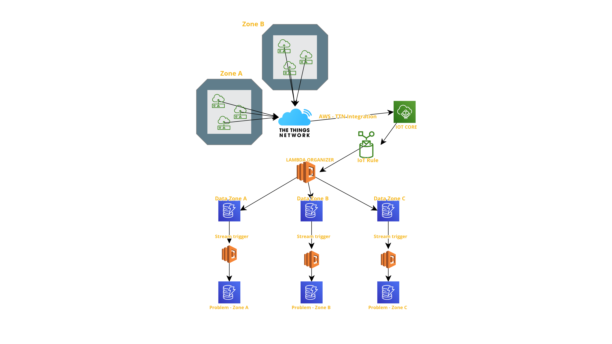
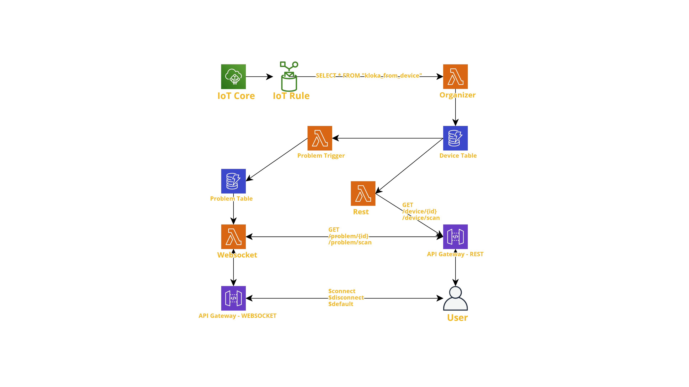

# Technology - AWS
In this section are explained all the steps made for developing the Kloaka's backend infrastructure.

## Main model

Main AWS services used are:
- AWS Lambda: Serverless functions
- DynamoDB: NoSQL Database with stream integration
- API Gateway: Expose REST and WebSocket API's
- IoT Core: Mqtt Broker and Rules
- CloudFormation: Production Templates

With [Serverless Framework](https://www.serverless.com), integrating AWS CLI, yaml and Node.JS, we built the whole backend infrastructure, managing all the services directly from cli or yaml file.

Serverless Framework's aim is to easy create a CloudFormation Template, upload it on AWS and deploy all functionalities producted.


## Data from Devices - Lambda Organizer
First step of the Kloaka machine is to have devices data on the cloud. Every device, through [TTN & AWS IoT Core integration](https://www.thethingsnetwork.org/docs/applications/aws/), can publish on IoT Mqtt Broker. Everytime a message is posted, an IoT Rule is called 
```sql
SELECT * FROM 'kloaka_from_device'
```
and a Lambda is triggered: Lambda "Organizer".

Main goal of this function is to organize and format data riceived from devices and put them in the DynamoDB Table.

Every device's message is a Json Object, styled as below
```json
{
    "id": "String",
    "filling": "String"
}
```
Where `id`, string type, is unique for every device and, at the moment, costructed as the first number refers to the tube and the second number refers to the sensor,
Then `filling`, string type, indicates the flow level.

When stored in DynamoDB Table, data are formatted as below

```json
{
    "id": "String",
    "last_value": "String",
    "last_update": "Timestamp",
    "measurements": [
        {
            "filling": "String",
            "dt": "Timestamp"
        },
        {
            "filling": "String",
            "dt": "Timestamp"
        }
    ]
}
```

Where:
- `last_value` indicates the last flow value received
- `last_update` indicates the timestamp of last flow value received
- `measurements` is an array of object, where all the last data are stored

`Timestamp` is a number, for example: 1658274939.

If a device publishes on the AWS Cloud for the first time, then it is registered on the DynamoDB Table. On the next publication, the fields are updated and the last measurement added to the array.

## DynamoDB Streams & Triggers

Devices are registered in a DynamoDB Table and updated everytime comes a measure. For estimate if a problem exists between two sensors, at the moment, we made a little assumption with the `filling` level

| Flow Level       | Assumption   |
| ---------------- |:------------:|
| 100              | Correct Flow |
| 50               | Low Flow     |
| 0                | No Flow      |

When a sensor's value is updated in DB, a Lambda function is triggered through the DynamoDB Stream functionalities. This Lambda checks the following sensor's filling value and compare this one with the current sensor's value

| Current Sensor | Following Sensor | Return Value |
| -------------- |------------------| :----------: |
| 100            | 100              | OK           |
| 100            | 50               | OBSTRUCTION  |
| 100            | 0                | OBSTRUCTION  |
| 50             | 100              | PROBLEM      |
| 50             | 50               | OK           |
| 50             | 0                | OBSTRUCTION  |
| 0              | 100              | PROBLEM      |
| 0              | 50               | PROBLEM      |
| 0              | 0                | OK           |

`Return Value` is stored in the "Problem Table", if not equal to "OK", with this format

```json
{
    "problem_id": "String",
    "problem": "String",
    "problem_time": "Timestamp",
    "problem_status": "String"
}
```

- `problem_id`: generated by the concatenation of current sensor's id and following sensor's id.
- `problem_status`: informations about the problem
- `problem_time`: timestamp
- `problem`: "OBSTRUCTION", "PROBLEM"

```
Example: id1 = 01, id2 = 02 -> problem_id = 0102.
{
    "problem_id": "0102",
    "problem": "OBSTRUCTION",
    "problem_time": 19282127361,
    "problem_status": "UNRESOLVED"
}
```

## Rest & WebSocket API


