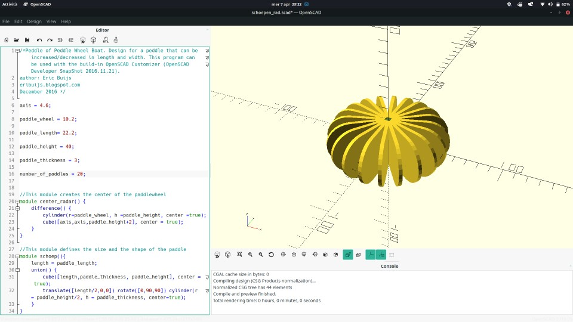
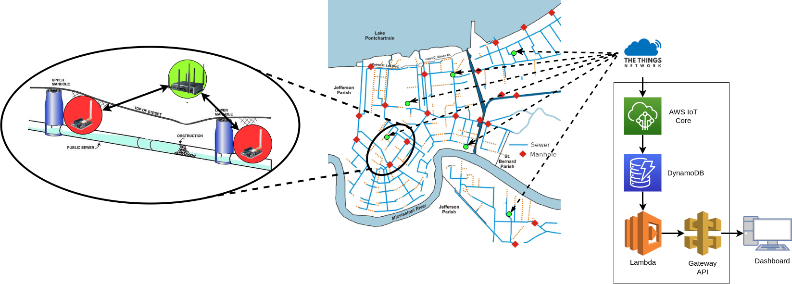

# Technology
This document provides technical details about kloaka.
## \[20/05/2021] V2: Group Project MVP Presentation

## \[08/04/2021] V1: Initial Ideas Pitch
## Sensors and data
Of course there are many metrics of interest to evaluate sewer water condition.
Based on the goal of the device we chose the following.
### Water turbidity
A water turbidity sensor like the [SEN0189](https://media.digikey.com/pdf/Data%20Sheets/DFRobot%20PDFs/SEN0189_Web.pdf) will be used to measure amount of suspended particles in sewer water to assess it's polluting rate.
As from the datasheet:

> It uses light to detect
> suspended particles in water by measuring the light transmittance and scattering rate, which
> changes with the amount of total suspended solids (TSS) in water. As the TTS increases, the liquid
> turbidity level increases. 

### pH sensing
Measuring water's pH is essential to know if the water will damage aquatic organisms.
This measurement is entrusted to a sensor such as the [SEN0169](https://media.digikey.com/pdf/Data%20Sheets/DFRobot%20PDFs/SEN0161_SEN0169_Web.pdf).
Key caracteristics for choosing this device are:
- Continuos measuring: the characteristic of beeng continusly immersed in water;
- Waterproofness;
- Durability: the particles and pH changes in the solution could reduce significantly the lifespan of the device.

This sensors works mapping pH changes to small voltage changes then amplified by the included board thus readable by our board.

### Measuring the flow
To measure the flow will be infeasible to use a device like [this](https://theorycircuit.com/water-flow-sensor-yf-s201-arduino-interface/) as the impurity and particles in wastewater could easly block it letting the device be unreliable.
So we reused the concept and camed up with a bigger 3d printed paddle wheel like the one below with an embedded rotary encoder.

From [this design](https://eribuijs.blogspot.com/2017/01/peddle-wheel-boat-3d-printed.html)
## Actuators

### A LED indicator
To reduce energy consuption and to increase the lifespan of the device the only actuator we choose to use in the device is a simple led to let the human operator precisely locate the fault site.
It lights up when the system detects an anomaly in the tubing that will be further solved from the operator.

## Network overview

### LoRaWAN
As the newtork will be sparse we chose LoRa as the transmitting medium for the device as it's capable of long range transmission, low energy consuption and a discrete resistance to interference.

### Device and antenna positioning
As the transmission obstruction underground could be significant, a multi-hop solution like [this](https://www.mdpi.com/1424-8220/19/2/402) would be cool but infeasible for this project so we decided to place the device not too far from manholes and place the antenna outside the sewer underground infrastructure.

### Messagge passing
As LoRaWAN and The Thinghs of Network seems to have a good integration with AWS services [as stated here](https://aws.amazon.com/it/blogs/iot/connect-your-devices-to-aws-iot-using-lorawan/) we will proceed like this, probably straight forward.

## Think, show and act
### Data processing
Data from the onboard environmental sensors and external data of city air pollution and marine pollution are aggregated to determine the efficiency of the purification process of wastewater, to know if there is some "illegal addition of wastewater" and to determine the impact of city pollution over marine pollution.

The wastewater flow data from adiacent devices is then processed to determine the direction and the intensity of the flow in a given section of the sewer with which we can determine if at some point there is a blockage determined by garbage or leaks in the tubing looking for differences in flows beween the two adiacent devices.
Furthermore using meteorological data we can extimate futures flows based on precipitation to schedule maintainance.

### Dashboard
To monitor the status of the sewer and let the operators act there will be a dashboard providing infos on the detetced flows and amount of pollutants on the sewer map, it will let the operator clearly visualize the detected malfuncioning sewer sections in the map via a Geographic Information Systems (GIS) providing their location and specifyng the problem.
Furthermore data from the environmental sensing could then be provided as open data.

