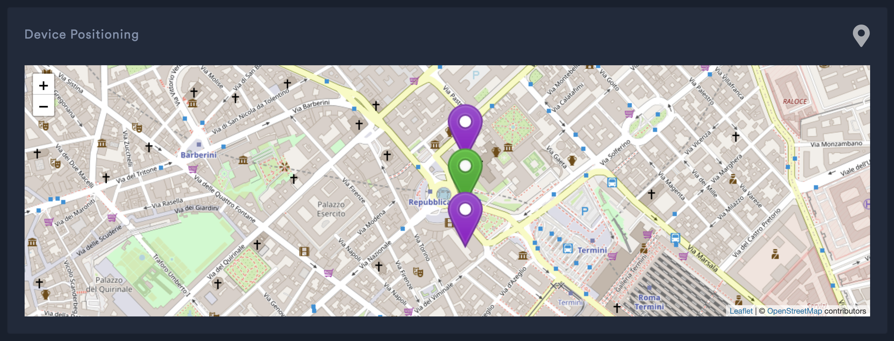

# Technology - AWS
In this section are explained all the steps made for developing the Kloaka's backend infrastructure.


## Main model

Main AWS services used are:
- AWS Lambda: Serverless functions
- DynamoDB: NoSQL Database with stream integration
- API Gateway: Expose REST and WebSocket API's
- IoT Core: Mqtt Broker and Rules
- CloudFormation: Production Templates

With [Serverless Framework](https://www.serverless.com), integrating AWS CLI, yaml and Node.JS, we built the whole backend infrastructure, managing all the services directly from cli or yaml file.

Serverless Framework's aim is to easy create a CloudFormation Template, upload it on AWS and deploy all functionalities producted.


### Data from Devices - Lambda Organizer
First step of the Kloaka machine is to have devices data on the cloud. Every device, through [TTN & AWS IoT Core integration](https://www.thethingsnetwork.org/docs/applications/aws/), can publish on IoT Mqtt Broker. Everytime a message is posted, an IoT Rule is called 

```sql
SELECT
end_device_ids.device_id as id,
end_device_ids.dev_eui as dev_eui,
uplink_message.frm_payload as filling
FROM 'thethings/lorawan/kloaka-ttn/#'
```

and a Lambda is triggered: Lambda **Organizer**.

Main goal of this function is to organize and format data riceived from devices and put them in the DynamoDB Table.

Every device's message is a Json Object, styled, for example, as below
```json
{
  "end_device_ids": {
    "device_id": "kloaka03",
    "application_ids": {
      "application_id": "kloaka"
    },
    "dev_eui": "5984656596326678",
    "join_eui": "0000000000000000"
  },
  "correlation_ids": [
    "as:up:01FANAC5RE0E1891WSN71S4TZ4",
    "rpc:/ttn.lorawan.v3.AppAs/SimulateUplink:5e068f67-c493-4293-92e2-6ba392177ad0"
  ],
  "received_at": "2021-07-15T14:50:49.487951507Z",
  "uplink_message": {
    "f_port": 1,
    "frm_payload": "MA==",
    "rx_metadata": [
      {
        "gateway_ids": {
          "gateway_id": "test"
        },
        "rssi": 42,
        "channel_rssi": 42,
        "snr": 4.2
      }
    ],
    "settings": {
      "data_rate": {
        "lora": {
          "bandwidth": 125000,
          "spreading_factor": 7
        }
      }
    },
    "received_at": "0001-01-01T00:00:00Z"
  },
  "simulated": false
}
```
Where `device_id`, string type, is unique for every device and, at the moment, costructed as, after `kloaka` text, the first number refers to the tube and the second number refers to the sensor,
Then `frm_payload`, under `uplink_message`, string type, indicates the flow level, encoded in *Base64*.

When stored in DynamoDB Table, data are formatted as below

```json
{
    "id": "String",
    "dev_eui": "String",
    "last_value": "String",
    "last_update": "Timestamp",
    "measurements": [
        {
            "filling": "String",
            "dt": "Timestamp"
        },
        {
            "filling": "String",
            "dt": "Timestamp"
        }
    ]
}
```

Where:
- `last_value` indicates the last flow value received
- `last_update` indicates the timestamp of last flow value received
- `measurements` is an array of object, where all the last data are stored

`Timestamp` is a number, for example: 1658274939.

If a device publishes on the AWS Cloud for the first time, then it is registered on the DynamoDB Table. On the next publication, the fields are updated and the last measurement added to the array.

### DynamoDB Streams & Triggers

Devices are registered in a DynamoDB Table and updated everytime comes a measure. For estimate if a problem exists between two sensors, at the moment, we made a little assumption with the `filling` level

| Flow Level       | Assumption   |
| ---------------- |:------------:|
| 100              | Flow         |
| 0                | No Flow      |


When a sensor's value is updated in DB, a Lambda function is triggered through the DynamoDB Stream functionalities. This Lambda checks the following sensor's filling value and compare this one with the current sensor's value.

Compared values are also implemented through the [openweathermap API](https://openweathermap.org/), that return us a `json object` with current weather infos about sensor's placement, used to improve the comparison process.

The following table resumes the results:

| Current Sensor | Following Sensor | Weather Data    | Return Value |   Description                   |
| -------------- |------------------| :-------------: | :----------: | :-----------------------------: |
| 100            | 100              | No weather data | OK           | NO                              |
| 100            | 100              | Good Weather    | OK           | NO                              | 
| 100            | 100              | Bad Weather     | OK           | NO                              |
| 100            | 0                | No weather data | OBSTRUCTION   | NO_WEATHER_DATA                 |
| 100            | 0                | Good Weather    | PROBLEM      | Probably leak or obstruction    |
| 100            | 0                | Bad Weather     | OBSTRUCTION  | Probably due to bad weather     |
| 0              | 100              | No weather data | PROBLEM      | NO_WEATHER_DATA                 |
| 0              | 100              | Good Weather    | OTHER        | Possible illegal substance dump |
| 0              | 100              | Bad Weather     | PROBLEM      | Probably due to bad weather     |
| 0              | 0                | No weather data | OK           | NO                              |
| 0              | 0                | Good Weather    | OK           | NO                              |
| 0              | 0                | Bad Weather     | OK           | NO                              |


`Return Value` is stored in the "Problem Table", if not equal to "OK", with this format

```json
{
    "problem_id": "String",
    "problem": "String",
    "problem_time": "Timestamp",
    "problem_status": "String",
    "problem_description": "String"
}
```

- `problem_id`: generated by the concatenation of current sensor's id and following sensor's id.
- `problem_status`: informations about the problem status (RESOLVED etc...)
- `problem_time`: timestamp
- `problem`: "OBSTRUCTION", "PROBLEM", "OTHER"
- `problem_description`: More informations about problem (combined with weather data)

```
Example: id1 = 01, id2 = 02 -> problem_id = 0102 [weather=GOOD and Flow level down].
{
    "problem_id": "0102",
    "problem": "OBSTRUCTION",
    "problem_time": 19282127361,
    "problem_status": "UNRESOLVED",
    "problem_description": "Probably due to bad weather"
}
```

### Rest & WebSocket API


All the `GET` endpoints are exposed publicly.
We have two type of API Gateway endpoints:
* API REST
  * `/device/{id}` -> Return informations about a single device
  * `/device/scan` -> Return informations about all devices
  * `/problem/{id}` -> Return informations about a single problem
  * `/problem/scan` -> Return informations about all problems
* WEBSOCKET API
  * `$connect` -> Connect to WebSocket API
  * `$disconnect`-> Disconnect from WebSocket API
  * `$default` -> Exchange of data through Websocket Channel

At the moment there aren't `POST`, `REMOVE` or `PUT` endpoints, so there is no type of protection on the API endpoints. Data are open to everyone who wants!


- WEBSOCKET ENDPOINT: `wss://0o7o4txyea.execute-api.us-east-1.amazonaws.com/dev`
- API REST ENDPOINT: `https://mo6thqx9bj.execute-api.us-east-1.amazonaws.com`

### DashBoard

Web dashboard was made using [React framework](https://it.reactjs.org/) and allows the user to visualize data about:
* Single device (can be selected)
* Problems/Obstruction/Other total list
* Map with sensor (pins)




